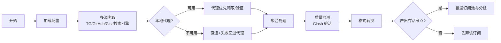

# Aggregator - 免费代理池构建工具

[](https://github.com/wzdnzd/aggregator/stargazers)
[](https://github.com/wzdnzd/aggregator/network)
[](https://github.com/wzdnzd/aggregator/issues)
[](https://github.com/wzdnzd/aggregator/blob/main/LICENSE)


## 🎯 项目简介

一个强大的免费代理池构建工具，通过爬取多个平台/网页的代理资源，自动验证、聚合并转换为各种客户端所需格式。

### ✨ 核心特性

- **🕷️ 多源爬取** - Telegram 频道、GitHub(代码/Issues/多模式搜索)、Gist 公开时间线、Google、Yandex 等
- **🔍 智能验证** - 自动检测代理活性和质量
- **🌐 本地代理支持** - 探活通过后,爬取与订阅验证均优先走本地代理,直连失败自动回退
- **🔄 格式转换** - 支持 Clash、V2Ray、SingBox 等格式
- **💾 灵活存储** - GitHub Gist、PasteGG、Imperial 等多种后端
- **🎯 精准推送** - 仅推送验活后确认产出过存活节点的订阅
- **🔌 插件系统** - 可扩展的自定义爬取架构
- **⚡ 高效处理** - 多线程并发，批量处理

### 🌐 支持协议
VMess | Trojan | SS | SSR | Snell | Hysteria2 | VLESS | Hysteria | TUIC | AnyTLS | HTTP | SOCKS

## 🚀 使用方式

### process.py(唯一入口)
**配置驱动** - 复杂配置、多源爬取、自定义规则、全存储后端

```bash
# 1. 准备配置文件
cp subscribe/examples/config.default.json my-config.json

# 2. 设置环境变量(.env 或 export)
export PUSH_TOKEN=your_github_token      # 存储推送(gist scope)
export GH_TOKEN=your_github_token        # GitHub/Gist 爬取(无 scope 即可)

# 3. 运行处理
python subscribe/process.py -s my-config.json
```

### 🎁 共享订阅
> 可前往 [Issue #91](https://github.com/wzdnzd/aggregator/issues/91) 获取现成的**共享订阅**，量大质优。**请勿浪费**

## 📊 工作流程



## ⚡ 快速配置

### 最小配置示例

**process.py 配置**：
```json
{
    "sites": [],
    "crawl": {
        "enable": true,
        "proxy": {
            "enable": true,
            "address": "http://127.0.0.1:7897",
            "test_url": "https://api.github.com/zen"
        },
        "telegram": {
            "enable": true,
            "channels": {
                "oneclickvpnkeys": {
                    "push_to": ["free"]
                }
            }
        },
        "github": {
            "enable": true,
            "push_to": ["free"]
        },
        "gist": {
            "enable": true,
            "push_to": ["free"],
            "max_gists": 100
        }
    },
    "groups": {
        "free": {
            "targets": {"clash": "free-clash"}
        }
    },
    "storage": {
        "engine": "gist",
        "items": {
            "free-clash": {
                "username": "your-username",
                "gist_id": "your-gist-id",
                "filename": "clash.yaml"
            },
            "crawledsubs": {
                "username": "your-username",
                "gist_id": "your-gist-id",
                "filename": "crawled-subs.json"
            }
        }
    }
}
```

**环境变量**：
```bash
export PUSH_TOKEN=your_github_token   # 存储推送,需 gist scope
export GH_TOKEN=your_github_token     # GitHub/Gist 爬取,无 scope 即可
export GH_COOKIE=your_session_cookie  # 可选:GitHub 网页搜索
```

### 常用命令

```bash
# 完整处理(爬取 + 验活 + 转换 + 推送)
python subscribe/process.py -s config.json

# 仅检查代理活性
python subscribe/process.py -s config.json --check

# 高性能模式
python subscribe/process.py -s config.json -n 128
```


## 📚 相关文档

| 文档                         | 说明            | 适用人群            |
| ---------------------------- | --------------- | ------------------- |
| [完整文档](README_CN.md)     | 详细配置说明    | 进阶用户            |
| [English Docs](README_EN.md) | English version | International users |


## 🔧 常见问题

| 问题         | 解决方案                                   |
| ------------ | ------------------------------------------ |
| 配置文件错误 | `python -m json.tool config.json` 验证语法 |
| Token 无效   | 检查 GitHub Token 权限和有效期             |
| 网络超时     | 增加超时 `-t 15000` 或减少线程 `-n 16`     |
| 无代理输出   | 检查爬取源配置和网络连接                   |


### 插件开发
拥有灵活的插件系统，支持自定义爬取目标。欢迎贡献高质量的爬取插件！

## 🚧 TODO 路线图

### 架构重构
- [ ] **核心接口设计** - 抽象出 `ICrawler`、`IStorage`、`IConverter` 等核心接口
- [ ] **基类实现** - 创建 `BaseCrawler`、`BaseStorage`、`BaseConverter` 抽象基类
- [ ] **具体实现重构** - 将现有爬虫、存储、转换模块改为继承基类并实现接口
- [ ] **工厂模式** - 使用工厂模式动态创建爬虫和存储实例，提升扩展性
- [ ] **模块解耦** - 通过接口依赖替代直接依赖，降低模块间耦合度

### 插件化架构
- [ ] **爬虫插件化** - 将 Telegram、GitHub、Google 等爬虫重构为独立插件
- [ ] **存储插件化** - 将 Gist、PasteGG、Imperial 等存储后端重构为插件
- [ ] **插件注册机制** - 实现插件自动发现和注册系统
- [ ] **插件配置标准化** - 定义统一的插件配置规范和验证机制

### 配置系统优化
- [ ] **配置模型化** - 使用 Pydantic 定义强类型配置模型
- [ ] **配置验证增强** - 实现配置完整性检查和错误提示
- [ ] **配置模板化** - 提供常用场景的配置模板和生成工具
- [ ] **配置文档化** - 自动生成配置项说明文档

### 代码质量提升
- [ ] **类型系统完善** - 全面引入类型注解，提升 IDE 支持和代码安全性
- [ ] **异常体系重构** - 设计统一的异常层次结构和错误码系统
- [ ] **日志标准化** - 实现结构化日志和统一的日志格式
- [ ] **代码风格统一** - 集成 Black、isort、flake8 等工具链

### 性能与稳定性
- [ ] **并发模型优化** - 改进线程池管理和任务调度机制
- [ ] **资源管理** - 实现连接池和资源自动回收机制
- [ ] **容错能力增强** - 完善重试策略和降级处理逻辑
- [ ] **内存优化** - 优化大数据处理的内存使用效率

---

## ⚖️ 免责声明

+ 本项目仅用作学习爬虫技术，请勿滥用，不要通过此工具做任何违法乱纪或有损国家利益之事
+ 禁止使用该项目进行任何盈利活动，对一切非法使用所产生的后果，本人概不负责
+ 使用者应遵守当地法律法规，尊重网站服务条款，合理使用网络资源

## 🙏 致谢

### 核心依赖
- [Subconverter](https://github.com/asdlokj1qpi233/subconverter) - 订阅转换核心
- [Mihomo](https://github.com/MetaCubeX/mihomo) - 代理测试引擎

### 赞助支持
感谢以下组织的赞助支持：
- [](https://yxvm.com)
- [NodeSupport](https://github.com/NodeSeekDev/NodeSupport)

### 社区贡献
感谢所有为项目贡献代码、提出建议和报告问题的开发者们！

<div align="center">

**如果这个项目对你有帮助，请给它一个 ⭐**

[报告问题](https://github.com/wzdnzd/aggregator/issues) · [功能请求](https://github.com/wzdnzd/aggregator/issues) · [贡献代码](https://github.com/wzdnzd/aggregator/pulls)

</div>
