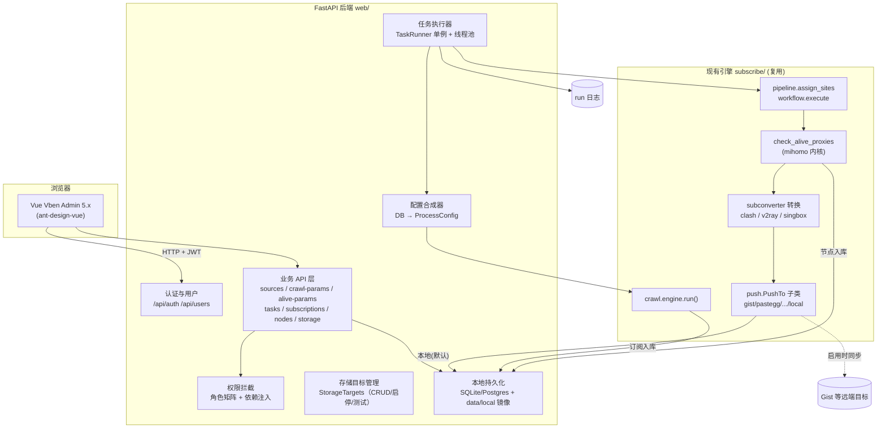
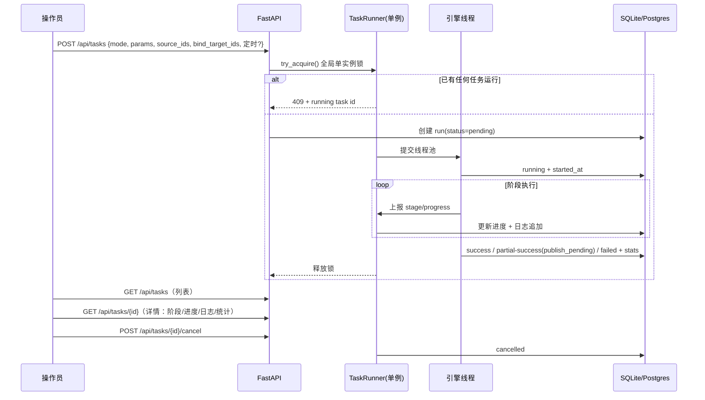
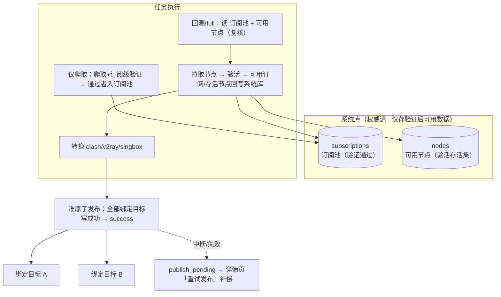
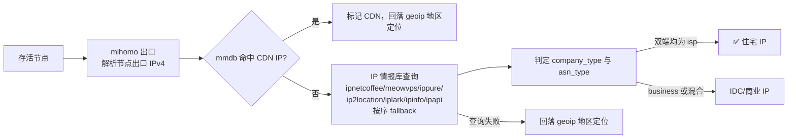
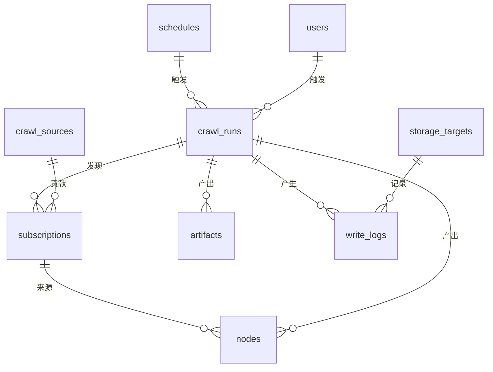

# Aggregator Web 管理平台 — 产品需求文档（PRD）

| 项目 | 内容 |
| --- | --- |
| 文档版本 | v2.4 |
| 日期 | 2026-10-04 |
| 状态 | 待评审（评审通过后方可进入开发） |
| 作者 | ZCode |
| 评审人 | 项目负责人（lantian） |
| 关联原型 | [./prototypes/](./prototypes/)（12 个 HTML 高保真原型页） |
| 开发模式 | 测试驱动开发（TDD）：先写失败测试 → 再实现 → 重构 |

## 版本记录

| 版本 | 变更 |
| --- | --- |
| v1.0 | 初版：单管理员、仪表盘、爬取源、任务、结果本地化 |
| v2.0 | ① 新增用户管理（RBAC 三种角色 + 启用/禁用）；② 任务管理改为「任务列表 + 任务详情 + 创建任务弹窗」结构；③ 取消分组概念，节点与订阅统一不分层；④ 节点导出支持选择客户端类型（clash/v2ray/singbox）并实时转换；⑤ 配置板块重组：爬取源配置仅保留源信息，爬取参数、验活参数、结果存储各自独立成页；⑥ 运行参数并入验活参数页；⑦ 新增结果存储目标管理（六类后端，CRUD + 启停 + 测试连接） |
| v2.1 | ① 删除爬取参数中的「默认任务参数」（节点重命名/分组标记，职责不清）；② 删除独立的「结果持久化绑定」与「写入策略」——数据流向统一由创建任务时绑定的存储目标决定；③ 存储目标不再有"系统默认本地目标"，全部目标平等管理、可自由启停删除，任务与存储配置解耦；④ 创建任务弹窗：模式默认「爬取+聚合」，移除"跳过验活/包含历史节点"复选框，按模式既定流程运行；⑤ 「仅聚合」更名「回测」；⑥ delay 参数正名为「最大存活延迟（阈值）」并补充释义；⑦ 回测/full 模式的旧数据（旧订阅池/旧节点快照）始终来自任务绑定的数据源目标 |
| v2.2 | ① 明确多目标覆写语义：绑定多个目标时，验活结果分别完整写入每一个绑定目标，数据源目标仅决定旧数据来源；② 创建任务弹窗：「执行范围」改为按源类型分组的大图标卡片选择、组内可细分；「定时执行」取消 cron 表达式输入，改为分钟级/小时级/天级/周级/每天几点/每周几的图形化间隔构建器；移除「测试 URL」配置项（统一在验活参数页维护）；运行参数滑块补充单位（ms）；「存储目标绑定」改为大图标卡片多选 + 数据源单选；③ 验活参数页「测试 URL」支持用户自定义增删列表（单选生效项），并明确两条探测路径：页面"测试连通性"经本地代理（如启用），实际节点验活经待测节点直连；④ 文档补充住宅 IP 识别机制说明（`location.check_residential`：出口 IP → 排除 CDN → IP 情报库 company/asn 类型判定） |
| v2.3 | 评审 grill 后定稿 4 项核心决策：① **系统库为旧数据唯一权威源**：订阅池 = 上轮 full/回测存活节点的来源订阅（由 nodes.source_sub 派生）；remains = 上轮 full/回测存活节点；full/回测默认将 remains 与本轮新节点合并验活；② **仅爬取模式的订阅仅入系统库**，不发布、不改变订阅池；③ **删除"数据源目标"概念**：存储目标绑定 = 纯写入目标，旧数据只从系统库读，与绑定目标无关；④ **发布准原子 + 补偿重试**：全部绑定目标写成功 run 才置 success，中断/部分失败记录 publish_pending，任务详情提供「重试发布」重放本轮产物。连带修订：任务互斥升级为全局单实例（任何模式互斥）；运行参数保留在弹窗 |
| v2.4 | Grill 遗留项整改（用户确认全部采纳）：① 存储目标管理（增删改、启停、凭证）收归 **admin**，消除 operator 将结果外发到任意目标的风险；② 补充三层 exclude 规则的合并顺序说明（源级 > 任务级 > 全局，`ignore_default_exclude` 每源开关）；③ 移除爬取源表单中的 `push_to` 字段（分组残留），导入时静默丢弃；④ 新增定时任务管理 UI 定义：创建弹窗选择"定时执行"= 保存 schedule 记录（不产生 run），schedule 列表位于任务管理页；⑤ 竞态规则：任务记录触发人快照，账号禁用不影响运行中任务，schedule 绑定目标被删则自动停用；⑥ "可用订阅"拆分为**订阅可达 / 节点可用**两级口径；⑦ 系统库 nodes 保留策略（默认最近 20 轮，历史 run 仅留统计）；⑧ 存储目标文件名模板定义（快照与产物命名规则）；⑨ 节点导出默认仅存活节点、emoji 开关入 PRD；⑩ 补充 google/yandex 源导入命名规则与"订阅验证等爬取阶段请求走本地代理"说明 |
| v2.5 | 结果口径与节点测试整治：① **节点浏览列表与顶部汇总统一关联系统库数据**：默认展示系统库全部轮次的散节点（kind=crawl，可用 run_id 筛选），汇总（存活数/平均延迟/住宅数/贡献爬取源）按散节点口径从系统库实时计算，不再绑定单轮任务；② **任务订阅统计按 URL 去重**（subs_total=去重后入订阅池条数，与订阅结果列表一致）；③ **节点状态测试重构**：测速/定位两阶段并发执行（复用引擎同源控制器与 location.batch_query 每节点独立监听端口），分阶段实时进度，住宅判定仅对存活节点发起，失效节点清空实测延迟；④ 任务详情「配置项」页签补全：运行配置/验活参数/执行范围（源名称）/发布与旧数据分组展示；⑤ 「现阶段结果」页签增加本轮结果摘要 |
| v2.6 | 结果入库语义重构（"系统库 = 验活后可用数据"）：① **订阅结果只存验证通过的订阅**——仅爬取模式以订阅级可达性验证为准；爬取+聚合/回测模式以「验活存活且产出可用节点」为准，未验证/无产出的订阅不入库；② **节点库只存验活存活节点**，每轮 full/回测后整体替换为本次存活集（含复核存活的旧节点，来源归属保留）；③ **旧数据复核对象 = 系统库当前可用数据**（订阅表全部行 + 节点库全部行），不再按"上一轮 run"派生；④ 旧订阅复核失败计数 +1 并标记失效，连续失败达 max_fails 移出订阅池；⑤ **本地代理注入运行作用域**：爬取参数启用本地代理时，爬取/订阅验证/节点拉取/发布经代理中转（代理优先、失败回退直连），节点验活保持节点直连；订阅手动测试同样走该代理；⑥ 废弃 nodes_keep_runs 保留轮数设置（节点库改为当前可用集，无历史明细堆积）；⑦ **订阅验证独立成阶段**（爬取→订阅验证→拉取，数千订阅探测不再静默挂在爬取源阶段，验证/拉取均并发执行并每 15s 上报进度，取消在安全点生效） |

---

## 1. 背景与目标

### 1.1 现状

aggregator 是一个命令行驱动的订阅聚合工具（Python 3.13）：`subscribe/crawl/` 通过 Google、Yandex、Telegram 频道、GitHub、Gist、通用网页、脚本插件等 8 类渠道采集免费订阅；`pipeline` + `airport` 解析订阅得到节点；`clash` 启动 mihomo 内核验活；`location` 规范化地区信息；`subconverter` 转换为 clash / v2ray / mixed / singbox 等多客户端格式；`push` 推送到 GitHub Gist 等 6 类存储后端（gist / imperial / pastefy / pastegg / qbin / local）。

### 1.2 痛点

1. **无管理界面**：操作依赖命令行与手工编辑 `my-config.json`，爬取源健康、任务执行结果无法直观查看；
2. **参数散落**：爬取参数、验活参数、存储配置混在同一份 JSON 与 `.env` 中，无法按职责分域管理；
3. **任务不可控**：无进度、无统计、无日志流、无法取消；
4. **结果不可读**：订阅池、节点快照推送到远端，本地无结构化留存，无历史回溯；
5. **无用户体系**：只有一份凭证文件，无法按职责给他人分配最小权限。

### 1.3 产品目标

| # | 目标 | 对应需求 |
| --- | --- | --- |
| G1 | 账号密码登录，不开放注册、不开放第三方登录；管理员可按权限创建用户并控制启停 | 需求 1 |
| G2 | 仪表盘集中展示可用订阅数、可用节点数、存储目标状态与历史趋势 | 需求 2 |
| G3 | 爬取源独立维护；爬取参数、验活参数、结果存储各自成页，职责分离 | 需求 3 |
| G4 | 任务列表化：点击任务查看进度、实时日志、统计；创建任务弹窗配置参数 | 需求 4 |
| G5 | 爬取结果本地化落库落盘，Web 端可检索、可按客户端类型导出转换 | 需求 5 |

### 1.4 非目标（Non-Goals）

- 不开放注册、不接第三方 OAuth；
- 不重写 `subscribe/` 现有爬虫、注册、验活、转换引擎，以复用 + 适配方式接入；
- 不做客户端级节点消费 UI（下载与分发仍由外部工具完成）；
- 本期不区分节点分组（分组能力从产品概念中移除）；
- 本期不实现英文 i18n（框架预留）。

---

## 2. 用户角色与使用场景

### 2.1 角色（RBAC）

| 角色 | 描述 | 权限 |
| --- | --- | --- |
| 管理员 admin | 系统负责人 | 全部功能：用户管理、爬取源/参数/存储配置、任务、结果、设置 |
| 操作员 operator | 日常运维 | 爬取源与参数维护、任务触发与取消、结果查看导出；**不可**管理用户与存储目标（存储目标的增删改与凭证仅管理员可操作，v2.4） |
| 只读 viewer | 观察者 | 仅查看仪表盘、源（只读）、任务、结果；不可触发/修改 |

- 首个管理员由初始化命令创建；之后由管理员在后台创建；
- 用户可被禁用；禁用后其令牌立即失效且无法登录；
- 每个功能动作记录操作审计（操作人、时间、动作、对象）。

### 2.2 核心场景

| 场景 | 描述 | 涉及页面 |
| --- | --- | --- |
| S1 日常巡检 | 登录看仪表盘：可用订阅/节点数、昨夜任务是否成功、存储目标是否可用 | 仪表盘 |
| S2 配置源 | 新增 Telegram 频道或网页 URL，设置过滤规则，测试连通后启用 | 爬取源配置 |
| S3 调参 | 在爬取参数页调整排除规则与代理；在验活参数页调整超时/线程并测试 | 爬取参数、验活参数 |
| S4 创建并跟踪任务 | 点击「创建任务」选模式与参数 → 列表出现新任务 → 点击查看阶段进度与实时日志 → 必要时取消 | 任务管理 |
| S5 取用结果 | 订阅结果页筛选存活订阅；节点页按协议/地区/延迟筛选，按客户端类型导出 | 订阅结果、节点浏览 |
| S6 存储管理 | 维护存储目标（本地默认启用；按需添加 Gist 等目标并测试连接） | 结果存储 |
| S7 团队协作 | 管理员创建操作员账号给运维同事，临时禁用离职人员 | 用户管理 |

---

## 3. 功能需求

> 优先级：P0 = 本期必须，P1 = 本期尽量，P2 = 可延后。

### 3.1 认证、用户与权限

| 编号 | 需求 | 优先级 |
| --- | --- | --- |
| FR-1.1 | 用户名 + 密码登录，密码 SHA256→bcrypt 哈希存储，永不明文落库或进日志 | P0 |
| FR-1.2 | 无注册入口：无注册页面、无注册 API；账号仅由初始化命令或管理员在后台创建 | P0 |
| FR-1.3 | 无第三方登录（GitHub/Google/OAuth 一律不接入） | P0 |
| FR-1.4 | 登录成功签发 JWT（HS256，12 小时），前端内存持有 + HttpOnly Cookie 刷新；过期跳登录页并回跳 | P0 |
| FR-1.5 | 登录保护：同账号连续 5 次失败锁定 15 分钟；响应不区分"用户不存在/密码错误"；接口按 IP+账号限流（10 次/分钟） | P0 |
| FR-1.6 | 未登录访问业务接口返回 401；前端路由守卫拦截 | P0 |
| FR-1.7 | 退出登录（服务端令牌失效 + 清理本地状态） | P0 |
| FR-1.8 | 用户可在「系统设置」修改自己的密码（需原密码；修改后该用户其他会话失效） | P1 |
| FR-1.9 | 用户管理：管理员可创建用户（用户名/密码/角色）、编辑、启用/禁用、删除（删除需二次确认，且不允许删除最后一个管理员） | P0 |
| FR-1.10 | 权限控制：按 2.1 角色矩阵拦截路由与 API；无权限操作返回 403 | P0 |
| FR-1.11 | 用户列表展示：用户名、角色、状态、最近登录、创建时间；支持按角色/状态筛选 | P1 |

### 3.2 仪表盘

| 编号 | 需求 | 优先级 |
| --- | --- | --- |
| FR-2.1 | 核心指标卡：**订阅可达数**（订阅 URL 探测可达，仅爬取/爬取+聚合后更新）、**节点可用数**（上轮 full/回测验活存活）、启用存储目标数、近 7 日新增订阅；展示较上轮变化。两级口径分离：仅爬取只更新"订阅可达"，不更新"节点可用" | P0 |
| FR-2.2 | 节点协议分布（vless/vmess/hysteria2/ss/trojan/anytls…）柱状图 | P0 |
| FR-2.3 | 节点地区 Top 5 与延迟区间分布（<300ms / 300-800ms / >800ms） | P0 |
| FR-2.4 | 最近任务运行列表：模式、触发、状态、耗时、订阅/节点统计 | P0 |
| FR-2.5 | 爬取源健康概览：按源类型统计启用数、上轮贡献数、连续失败源 | P1 |
| FR-2.6 | 存储目标状态卡：各目标启用/停用与最近一次写入结果 | P1 |
| FR-2.7 | 数据仅来自本地库，不请求远端服务 | P0 |

### 3.3 爬取源配置（仅源信息）

| 编号 | 需求 | 优先级 |
| --- | --- | --- |
| FR-3.1 | 爬取源 CRUD：8 种类型——telegram 频道、github 代码搜索、gist 时间线、google、yandex、通用网页(page)、github 仓库(repo)、脚本插件(script) | P0 |
| FR-3.2 | 每个源独立启用/禁用 | P0 |
| FR-3.3 | 每类型专属表单（字段与 `config/models.py` 对应数据类一致）：telegram 的 pages/channels/include/exclude；page 的 url 列表/paged/placeholder/start/end/headers；script 的 plugin/persist/options；google/yandex 的 limit/days/pages/exclude_sites 等。**不含 push_to**（分组概念已废止，导入旧配置时静默丢弃） | P0 |
| FR-3.4 | 多值/复合字段子组件：URL 列表（多行文本逐条解析）、headers 键值对编辑器、字符串数组标签编辑器 | P0 |
| FR-3.5 | 保存前校验：正则可编译、必填非空、数值范围（max_gists ∈ [1,5000] 等），字段级错误提示 | P0 |
| FR-3.6 | 「测试连接」子组件：page/repo 类源对 URL 做一次可达性探测（HEAD/GET 200），插件类检查是否在注册表内；展示响应码与耗时 | P1 |
| FR-3.7 | 表单级导入/导出：支持按类型导入源配置 JSON 或从 my-config.json 的 crawl 节导入；导出当前筛选结果为 JSON。导入命名约定：telegram=频道名、github/gist/repo/script=用户命名，**google/yandex 等无 name 的 section 以类型名命名**（google/yandex）；旧配置中的 push_to、task.push_to 静默丢弃并提示 | P1 |
| FR-3.8 | 删除源需二次确认，历史贡献记录保留 | P1 |

### 3.4 爬取参数（新建菜单）

| 编号 | 需求 | 优先级 |
| --- | --- | --- |
| FR-3.9 | 全局爬取参数配置页（与爬取源分离）：exclude（全局排除正则）、include/exclude 默认过滤、max_fails（最大连续失败，1-99，滑块控件）、include_nodes（是否包含原始节点开关） | P0 |
| FR-3.10 | 本地代理配置卡：启用开关、代理地址、测试 URL，以及「测试连接」按钮（发起一次经代理的请求，展示结果） | P0 |
| FR-3.11 | 参数表单支持导入/导出（与 my-config.json crawl 节互转） | P1 |
| FR-3.12 | 保存即生效于下一次任务；不修改运行中任务 | P0 |

> 说明：v2.0 曾在本页提供「默认任务参数」（节点重命名 rename、分组标记）与「结果持久化绑定」（crawl.persist）。v2.1 移除二者：节点命名规则随订阅解析自动生成，无单独配置必要；**结果写哪里由创建任务时绑定的存储目标决定，旧数据从哪里读由系统库决定**（见 FR-4.3 与 FR-5.14），不再单独设置。旧配置导入时 `crawl.persist` 节将被忽略并提示。

**过滤规则合并顺序（三层，v2.4 补充）**：订阅命中任一层排除即被丢弃，合并规则为 `源级 exclude`（最高优先）→ `任务级 task.exclude`（默认过滤，可为空）→ `全局 crawl.exclude`（最低）；`include` 同理。`ignore_default_exclude` 改造为每源一个「忽略全局/任务级规则」开关；合并后的最终正则在前端可视化展示，订阅结果页详情可查「该订阅被哪条规则拦截」。

### 3.5 验活参数（新建菜单）

| 编号 | 需求 | 优先级 |
| --- | --- | --- |
| FR-3.13 | 验活参数页：节点验活超时 timeout（500-30000ms，滑块，单次探测请求最长等待）、**最大存活延迟 delay（500-15000ms，滑块，存活判定阈值——节点实测延迟超过该值即计为失效）**、线程数 num_threads（1-128，滑块）、HTTP 重试 retry（1-10）、测试 URL（默认 https://www.google.com/generate_204） | P0 |
| FR-3.14 | 测试 URL 管理：支持用户自定义增删探测地址列表（单选其一为当前生效 URL，非法 http(s) 地址拒绝添加，不允许删除最后一个）；「测试连通性」按钮的探测路径为**经本地代理**（当爬取参数页启用代理时），用于验证代理链路本身可用 | P1 |
| FR-3.14a | 探测路径语义（需在产品内明示）：页面「测试连通性」走本地代理（如启用）；**实际节点验活由 mihomo 内核经待测节点自身直连测试 URL**，不经过本地代理——二者路径不同，前者排查代理、后者度量节点。同理，**爬取阶段全部请求（渠道抓取、订阅验证 check_status）均走本地代理（如启用）**，仅节点验活直连 | P0 |
| FR-3.15 | 参数说明与推荐值提示（如线程数超过 mihomo 承载能力的风险提示；最大存活延迟与验活超时的区别说明） | P2 |
| FR-3.16 | 高级选项：控制器故障时保留上轮已发布结果、节点规范化（地区/住宅识别）开关；**不提供"跳过验活"全局开关**——验活是回测/爬取+聚合模式的既定核心步骤 | P0 |

### 3.6 任务管理

| 编号 | 需求 | 优先级 |
| --- | --- | --- |
| FR-4.1 | 任务列表：每次任务执行生成一条记录，表格展示 ID、模式（仅爬取/回测/爬取+聚合）、触发方式（手动/定时）、状态（pending/running/success/failed/cancelled）、阶段、进度、统计摘要、耗时、开始时间 | P0 |
| FR-4.2 | 点击任务行进入任务详情（列表-详情主从布局）：阶段进度条（初始化→爬取源→订阅验证→节点拉取→验活→转换→发布）、实时日志流（自动滚动/暂停/仅看警告错误）、统计信息、本次运行参数（含绑定的存储目标）、关联产物清单。详情页签三档：**实时日志**（固定高度日志面板，自动滚动/仅看警告错误/下载）、**配置项**（分组展示：运行配置=模式/触发/开始时间/耗时，验活参数=线程数/最大存活延迟/验活超时/测试 URL，执行范围=爬取源名称清单，发布与旧数据=绑定目标名称 + 旧数据来源=系统库）、**现阶段结果**（本轮结果摘要 + 转换产物清单 + publish_pending 补偿重试入口） | P0 |
| FR-4.3 | 「创建任务」按钮 → 弹窗：① 运行模式卡片三选一，**默认选中「爬取 + 聚合」**：🕷️ 仅爬取（爬取源并验证订阅可达性，仅验证通过者入订阅池；散节点未验活不入节点库；不绑定目标、不发布）；🧬 回测（不爬取：复核系统库订阅池与可用节点 → 重新拉取 → 验活 → 可用结果回写系统库 → 写入绑定目标）；⚡ 爬取+聚合（爬取新订阅/散节点 → 与系统库可用数据合并复核 → 验活 → 仅可用结果入系统库 → 转换 → 写入绑定目标）；② 运行参数滑块（线程数/最大存活延迟/验活超时，均带 ms 单位，默认值取自验活参数页，可临时覆盖）；**不提供测试 URL 配置项**（统一在验活参数页维护）；③ **存储目标绑定（回测/爬取+聚合必填）**：大图标卡片多选本轮**写入目标**（已停用的目标不可绑定），未绑定时禁止提交并提示；**旧数据（订阅池/remains）一律来自系统库，与绑定目标无关，因此不设"数据源目标"**；④ 执行范围（仅爬取+聚合时按**源类型分组的大图标卡片**选择，卡片显示"已选 x/y 个源"与三态勾选，点击展开组内单个源的细粒度复选框，支持全选/全不选）；⑤ 执行方式：立即执行，或**图形化定时构建器**（分钟级/小时级/天级/周级/每天几点/每周几，步进器+时间选择器+星期选择，实时生成人类可读的执行计划与下次执行时间，**不暴露 cron 表达式**）。**不再提供"跳过验活""包含历史节点"等流程开关，各模式按既定流程运行（含 remains 合并，见 FR-5.14）** | P0 |
| FR-4.4 | **全局单实例**：同一时刻仅允许一个任务运行（仅爬取/回测/爬取+聚合均互斥——mihomo 验活内核与存储写入都是独占型资源）；重复触发返回 409 并提示当前运行中任务 | P0 |
| FR-4.5 | 支持取消运行中任务（取消信号在安全点生效，最多 30 秒内置为 cancelled） | P0 |
| FR-4.6 | 每次运行落库统计：新增订阅、存活订阅、失效订阅、抓取节点、存活节点、产物清单、各阶段耗时。**订阅统计按 URL 去重后计数**（跨源重复命中只算一条），与订阅结果列表/订阅池条数一致 | P0 |
| FR-4.7 | 任务详情可回看已结束任务的完整日志与统计 | P0 |
| FR-4.8 | 定时任务管理（位于任务管理页）：通过图形化间隔构建器创建（分钟级/小时级/天级/周级/每天几点/每周几），内部持久化为 cron 表达式但界面对用户不可见；支持模式、参数、绑定目标与启停，到期自动生成 run 记录。**创建任务弹窗选择「定时执行」= 保存 schedule 记录（不立即产生 run）**；schedule 列表展示下次执行时间与上次结果，可编辑/停用/删除 | P1 |
| FR-4.9 | 命令行动态兼容：CLI 启动的运行结果也可见（解析 workflow.log 归档） | P2 |
| FR-4.10 | **发布一致性（准原子 + 补偿重试）**：发布阶段要求全部绑定目标写入成功，run 才置 success；中断（取消/崩溃）或部分目标失败时，记录待补偿目标清单（`publish_pending`），任务详情提供「重试发布」——对失败目标重放本轮 artifacts，直至全部成功；放弃补偿的 run 标记为 `partial-success`（系统库数据始终可用，产物以已完成目标为准） | P0 |

### 3.7 结果与导出

| 编号 | 需求 | 优先级 |
| --- | --- | --- |
| FR-5.1 | 订阅系统库：爬取验证后的订阅写入系统库 subscriptions 表，供订阅结果页浏览与检索；**仅爬取模式的订阅仅入系统库，不发布到任何目标、不进入供任务使用的订阅池** | P0 |
| FR-5.2 | 节点系统库（权威）：**只保存验活确认可用的节点**——每轮 full/回测完成后，nodes 表整体替换为本次验活存活集（含复核存活的旧节点，爬取源/来源订阅归属保留），作为下一轮旧数据复核与可用统计的唯一权威来源；失效节点不堆积在库中；向存储目标的快照镜像（JSON/YAML）随任务绑定的目标流转，目标侧快照按该目标配置的保留份数清理 | P0 |
| FR-5.3 | 订阅结果页：url、来源、状态（存活/待验证/失效）、连续失败次数、首次发现/最近存活时间、贡献节点数；支持筛选/搜索/排序 | P0 |
| FR-5.4 | 节点结果页：名称、协议、服务器、延迟、地区、住宅标记、来源订阅；支持按协议/地区/存活/延迟区间筛选与搜索；**不区分分组** | P0 |
| FR-5.5 | 节点导出：点击「导出」→ 弹窗选择目标客户端类型（Clash 配置 / V2Ray（mixed）/ SingBox）→ 服务端经 subconverter 实时转换 → 生成文件供下载；导出弹窗展示可选节点范围与预计节点数。**默认仅导出存活节点**，失效节点需显式勾选"包含失效"；保留 emoji 节点名开关、数据轮次与来源筛选 | P0 |
| FR-5.6 | 导出历史记录（最近 10 次）：类型、节点数、大小、时间 | P1 |
| FR-5.7 | 订阅与节点支持 CSV 导出 | P1 |
| FR-5.8 | **节点浏览展示系统库当前可用散节点**（kind=crawl，节点库为验活存活集，可用 run_id 筛选）；节点浏览顶部汇总（存活散节点/平均延迟/住宅 IP 数/贡献爬取源）一律按系统库散节点实时计算，不绑定单轮任务。**subscriptions 表只存验证通过的订阅**（仅爬取=可达性验证通过；full/回测=验活存活且产出可用节点），未验证/无产出数据不入库；旧订阅复核失败计数 +1，连续失败达爬取参数 max_fails 移出订阅池 | P1 |
| FR-5.9 | 订阅/节点详情抽屉：完整字段、来源订阅、历史存活趋势（订阅）/原始 raw 字段（节点） | P0 |
| FR-5.17 | 结果板块批量状态测试：① 订阅结果「测试订阅状态」：勾选订阅或全部，状态置 testing，完成后更新存活状态/节点数/最近存活时间；② 节点浏览「测试节点状态」：勾选散节点或全部，两阶段并发执行并展示分阶段实时进度（测速→定位）——测速经自管 mihomo 控制器并发查询延迟端点（参数默认取验活参数页），定位经引擎同源 `location.batch_query`（每节点独立监听端口）获取地区与住宅判定，**住宅判定仅对存活节点发起**；失效节点延迟置空（不保留上一轮实测值），不重命名节点 | P1 |

### 3.8 结果存储（新建菜单）

| 编号 | 需求 | 优先级 |
| --- | --- | --- |
| FR-5.10 | 结果存储目标管理页：列表展现当前配置的存储目标，类型覆盖 aggregator 现有全部后端：**本地(local)、GitHub Gist、PasteGG、Pastefy、Imperial、QBin**；所有目标平等管理（无"系统默认"特权目标，可创建多个本地目录目标） | P0 |
| FR-5.11 | 每个目标支持：创建、编辑、删除（二次确认）、启用/停用；列表展示类型、名称、目标摘要（本地目录/gist id/base 等）、写入状态。**管理权限仅 admin**（operator 只读，见 §2.1，v2.4 收紧） | P0 |
| FR-5.12 | 每个目标提供「测试连接」子组件：local 测试目录可写；gist 测试 token 权限与 gist 可读写；pastegg/pastefy/imperial/qbin 测试 base 可达与 token 有效；展示结果与耗时 | P0 |
| FR-5.13 | 目标与任务解耦：存储页只管理"目标"本身；每轮任务的**写入目标**由创建任务时绑定决定——回测/爬取+聚合模式必须绑定至少一个已启用目标才能提交，仅爬取模式不绑定。**绑定只决定"结果写到哪"；旧数据（订阅池、remains）只从系统库读取，与绑定目标无关——因此不设"数据源目标"配置**。不再存在"默认写入目标""持久化绑定""写入策略""数据源目标"等独立设置 | P0 |
| FR-5.14 | 绑定与旧数据语义：① **写入**：绑定的目标集合 = 本轮结果的写入目标（clash/v2ray/singbox 产物 + 可选快照镜像），多目标时分别完整覆写每一个绑定目标；② **旧数据（系统库当前可用数据，与目标无关）**：订阅池 = 系统库订阅表全部行（仅存验证通过的订阅）；remains = 系统库节点表全部行（仅存验活存活节点）；full/回测默认将 remains 与本轮新节点合并后统一验活（Web 版固定启用，替代 CLI 的 `--overwrite` 反向行为）；③ 仅爬取模式以订阅级可达性验证为准更新订阅池，不触碰节点库 | P0 |
| FR-5.15 | 每个目标展示最近一次写入时间与结果（成功/失败/错误摘要） | P1 |
| FR-5.16 | 凭证安全：token 类字段写入后不回显明文，仅显示掩码；测试连接在前端不暴露完整 token | P0 |
| FR-5.17 | 目标内文件名模板（v2.4）：订阅池快照 `crawled-subs.json`；节点快照 `nodes-{run}.yaml`；产物按目标客户端类型固定命名 `clash.yaml` / `v2ray.txt` / `singbox.json`；gist 类目标在同一 gist 下以不同 filename 区分，local 类目标在目录下按上述文件名存放 | P1 |

### 3.9 系统设置

| 编号 | 需求 | 优先级 |
| --- | --- | --- |
| FR-6.1 | 修改本人密码（FR-1.8） | P1 |
| FR-6.2 | 关于：版本、模板信息（Vue Vben Admin 5.x）、许可 | P2 |
| FR-6.3 | 系统运行日志查看（最近 1000 行） | P2 |

> 说明：原「运行参数默认值」已并入验活参数页（3.5）；原「本地存储」已升级为结果存储目标管理页（3.8）。

---

## 4. 非功能需求

| 编号 | 类别 | 需求 |
| --- | --- | --- |
| NFR-1 | 安全 | 密码 SHA256→bcrypt；JWT 密钥首次启动自动生成；全接口强制鉴权；SQL 参数化；token 类配置掩码存储、不回显、不入日志 |
| NFR-2 | 安全 | 登录限流（IP 10 次/分钟）+ 账号锁定（5 次/15 分钟）；RBAC 服务端强校验（不只依赖前端隐藏） |
| NFR-3 | 安全 | 用户禁用即时生效：禁用后 60 秒内其持有令牌不可用（令牌黑名单/版本号机制） |
| NFR-4 | 审计 | 用户管理、参数变更、存储目标变更、任务触发/取消记录审计日志（操作人/时间/动作/对象） |
| NFR-5 | 性能 | 仪表盘接口 P95 < 500ms（本地库 + 预聚合/索引）；节点列表分页 P95 < 300ms；导出转换 5000 节点内 < 10s |
| NFR-6 | 性能 | 任务运行不阻塞事件循环（线程池），Web 常驻内存增量 < 200MB |
| NFR-7 | 可靠 | 任务崩溃/被杀后 run 置 failed 并保留已产数据；进程重启清理残留 running |
| NFR-8 | 可靠 | 多存储目标写入相互隔离：单一目标失败不影响其他目标写入；发布为准原子流程——全部绑定目标成功 run 才置 success，否则记录 publish_pending 待补偿清单（见 FR-4.10）；补偿完成前系统库数据始终可用，Web 端结果不受发布状态影响 |
| NFR-9 | 兼容 | Python ≥ 3.13、Windows/Linux；mihomo 与 subconverter 二进制沿用仓库文件；支持从 my-config.json 导入 |
| NFR-10 | 可维护 | 分层：api / service / engine adapter / store；纯函数（配置合成、过滤、序列化）可单测 |
| NFR-11 | 部署 | 单进程：`python -m web` 启动 uvicorn，前端产物静态托管，默认 8080 |
| NFR-12 | 可靠 | 生命周期竞态（v2.4）：运行中任务记录触发人快照（actor_id 关联 users 但不级联删除，用户删除后审计保留）；禁用/删除用户不影响其已触发的运行中任务；schedule 绑定的目标被删除时该 schedule 自动停用并标记错误原因；系统库定期清理（nodes 保留最近 N 轮）在任务启动时执行，不影响运行中任务 |

---

## 5. 架构设计

### 5.1 总体架构



### 5.2 任务管理结构（列表 → 详情）



### 5.3 任务绑定与数据流向

> v2.3 决策：**系统库是旧数据唯一权威源，存储目标是纯发布出口**。订阅池与可用节点均直接存于系统库（仅验证通过的数据），与绑定目标无关；因此创建任务只需选择"写入目标"，不再需要"数据源目标"。v2.6 起系统库不再堆积未验证数据：订阅只存验证通过者，节点只存验活存活者。



- **仅爬取**：验证通过的订阅入订阅池（浏览用），散节点未验活不入节点库，不发布；
- **回测**：复核系统库订阅池（全部行）+ 可用节点（全部行）→ 拉取 → 验活 → 可用结果回写系统库 → 产物写入绑定目标；
- **爬取+聚合**：爬取新订阅/散节点 → 与系统库可用数据合并复核 → 同上；
- **准原子发布**：全部绑定目标写成功 run 才置 success；任一失败/中断记录 `publish_pending`，任务详情提供「重试发布」对失败目标重放本轮 artifacts；
- 失败隔离：单一目标失败不影响其他目标写入与系统库可用性（NFR-8）。

### 5.5 节点规范化与住宅 IP 识别

复用 `subscribe/location.py` 现有实现，在验活通过后执行（回测/full 模式的既定步骤，无单独开关）：



要点：

1. **出口识别**：通过 mihomo 控制器经节点本身发出请求，解析其出口 IPv4（非节点服务器 IP）；
2. **CDN 排除**：配置 mmdb reader 时，出口 IP 命中 CDN 段则直接判非住宅并转地区定位；
3. **情报库判定**：由 IP 情报库返回 `company_type` 与 `asn_type`，**两者均为 `isp` 判为住宅 IP**，`business` 或混合判为商业/IDC；
4. **回落策略**：任一环节失败回落 geoip 地区定位，不阻塞主流程；
5. 判定结果写入 nodes 表 `residential` 字段，仪表盘与节点页展示"住宅"标记与统计。

### 5.4 与现有 CLI / push 模块的关系

| 现有能力 | Web 化方式 |
| --- | --- |
| `push.get_instance(storage)` 单引擎 | 保留；Web 侧将选中的 StorageTarget 合成为 StorageConfig 后调用；每个目标一次合成 |
| `storage.engine` 单值 | 由 storage_targets 表管理多目标，默认 local；合成时以启用集合为准 |
| `my-config.json` | crawl 节可导入为源 + 爬取参数；storage 节可导入为存储目标种子 |
| GitHub Actions 定时 | Web 内 APScheduler，等价 cron |

---

## 6. 数据模型

### 6.1 ER 图



### 6.2 表结构

#### users — 用户

| 字段 | 类型 | 约束 | 说明 |
| --- | --- | --- | --- |
| id | INTEGER | PK | |
| username | VARCHAR(64) | UNIQUE, NOT NULL | 登录名 |
| password_hash | VARCHAR(255) | NOT NULL | SHA256→bcrypt |
| role | VARCHAR(16) | NOT NULL | admin / operator / viewer |
| enable | BOOLEAN | DEFAULT 1 | 禁用后令牌立即失效 |
| token_version | INTEGER | DEFAULT 0 | 改密/禁用/改角色时 +1，旧令牌失效 |
| failed_count / locked_until | INTEGER / DATETIME | | 登录锁定 |
| created_at / last_login_at | DATETIME | | |

#### crawl_sources — 爬取源

| 字段 | 类型 | 说明 |
| --- | --- | --- |
| id | INTEGER PK | |
| type | VARCHAR(32) | telegram / github / gist / google / yandex / page / repo / script |
| name | VARCHAR(128) UNIQUE | 源名称 |
| enable | BOOLEAN DEFAULT 1 | |
| config | JSON | 该类型独有字段（与 config/models.py 对应数据类一致） |
| created_at / updated_at | DATETIME | |

#### crawl_runs — 任务运行记录

| 字段 | 类型 | 说明 |
| --- | --- | --- |
| id / run_uuid | INTEGER PK / VARCHAR(36) | |
| trigger | VARCHAR(16) | manual / schedule / cli |
| mode | VARCHAR(16) | crawl / aggregate / full |
| status | VARCHAR(16) | pending / running / success / failed / cancelled / **partial-success** |
| stage | VARCHAR(32) NULL | init / crawl / validate / fetch / check / convert / publish |
| progress | JSON NULL | 如 {"check": "312/980"} |
| params | JSON | 运行参数快照（num_threads/max_delay/timeout/test_url + source_ids + **bind_target_ids**；v2.3 起无 source_target_id，旧数据只从系统库读） |
| **publish_pending** | JSON NULL | 待补偿写入的目标 id 清单（准原子发布中断/部分失败时记录，见 FR-4.10） |
| stats | JSON NULL | 见下 |
| actor_id | INTEGER FK → users | 触发人快照（用户删除后保留审计） |
| error | TEXT NULL | |
| started_at / finished_at / duration_ms | | |

stats 结构：

```json
{
  "sources_total": 12, "sources_ok": 10,
  "subs_new": 2, "subs_alive": 41, "subs_dead": 8,
  "nodes_total": 1256, "nodes_alive": 612,
  "artifacts": [{"target": "clash", "path": "data/local/free-clash.yaml", "size": 89421}],
  "phases": {"crawl_ms": 51200, "check_ms": 22300}
}
```

#### subscriptions — 订阅（系统库）

> 注意：本表即**订阅池本体**——只保存验证通过的订阅（仅爬取=可达性验证；full/回测=验活存活且产出可用节点），未验证/无产出数据不入库；full/回测的复核对象就是本表全部行（FR-5.14）。

| 字段 | 类型 | 说明 |
| --- | --- | --- |
| id / url | INTEGER PK / VARCHAR(1024) UNIQUE | |
| origin | VARCHAR(16) | 来源类型 |
| status | VARCHAR(16) | alive / dead / pending |
| errors | INTEGER DEFAULT 0 | 连续失败次数 |
| discovered / skip_cache / allow_nonstandard | BOOLEAN | |
| first_seen_at / last_seen_at / last_alive_at | DATETIME | |

#### nodes — 节点（无分组）

| 字段 | 类型 | 说明 |
| --- | --- | --- |
| id / run_id | INTEGER PK / FK | 归属轮次 |
| name / protocol | VARCHAR / VARCHAR(16) | ss / vmess / vless / trojan / hysteria2 / anytls … |
| server / port | | |
| source_sub | VARCHAR(1024) NULL | 来源订阅 |
| delay_ms / region / residential | INTEGER NULL / VARCHAR / BOOLEAN | 后者为住宅 IP 标记（判定机制见 §5.5） |
| alive | BOOLEAN | 本轮是否存活 |
| raw | JSON | 完整字段 |
| created_at | DATETIME | |

#### artifacts — 产物

| 字段 | 类型 | 说明 |
| --- | --- | --- |
| id / run_id | PK / FK | |
| target | VARCHAR(16) | clash / v2ray / mixed / singbox |
| path / size / sha256 | | |
| created_at | | |

#### storage_targets — 存储目标

| 字段 | 类型 | 说明 |
| --- | --- | --- |
| id | INTEGER PK | |
| type | VARCHAR(16) | local / gist / pastegg / pastefy / imperial / qbin |
| name | VARCHAR(64) UNIQUE | 目标名称 |
| enable | BOOLEAN | 启停；全部目标平等，无特权目标 |
| config | JSON | 类型相关：local→{dir, keep}；gist→{gist_id}；pastegg/pastefy/imperial/qbin→{base, domain}；文件名按 FR-5.17 模板固定，不逐目标配置 |
| token_ref | VARCHAR(64) NULL | token 引用（加密存储，读取时掩码） |
| last_write_at / last_write_ok / last_write_error | | |
| created_at / updated_at | | |

#### write_logs — 写入记录

| 字段 | 类型 | 说明 |
| --- | --- | --- |
| id / run_id / target_id | | |
| kind | VARCHAR(16) | subscribe_pool / node_snapshot / artifact |
| ok / error / size | | |
| replayed | BOOLEAN DEFAULT 0 | 是否为「重试发布」补偿写入 |
| created_at | | |

#### schedules — 定时任务

| 字段 | 类型 | 说明 |
| --- | --- | --- |
| id / name | | |
| cron | VARCHAR(64) | 由图形化构建器生成（分钟级/小时级/天级/周级/每天几点/每周几），本地时区；UI 不暴露表达式 |
| mode / params | VARCHAR / JSON | 运行模式、参数与绑定的存储目标 |
| enable / last_run_at / next_run_at | | |

#### settings — 键值设置

| key | 说明 |
| --- | --- |
| crawl.exclude / crawl.max_fails / crawl.include_nodes | 爬取参数 |
| proxy.enable / proxy.address / proxy.test_url | 本地代理 |
| alive.timeout / alive.max_delay / alive.num_threads / alive.test_url / alive.retry | 验活参数（max_delay = 最大存活延迟阈值） |
| export.node_limit | 单次导出节点上限（防止超大文件） |

> v2.1 移除：`crawl.task_defaults`、`crawl.persist`、`alive.skip_default`。v2.6 移除：`system.nodes_keep_runs`（节点库改为验活存活集整体替换，无历史明细堆积）。

---

## 7. API 设计（REST）

统一约定：前缀 `/api`；除登录外需 `Authorization: Bearer <jwt>`；响应包 `{code, data, message}`；分页 `?page&page_size`。RBAC 在服务端以角色依赖注入实现。

| 方法 | 路径 | 说明 | 角色 |
| --- | --- | --- | --- |
| POST | /api/auth/login | 登录（限流+锁定） | 匿名 |
| POST | /api/auth/logout | 登出 | 全部 |
| GET | /api/auth/me | 当前用户信息+权限 | 全部 |
| PUT | /api/auth/password | 修改本人密码 | 全部 |
| GET/POST | /api/users | 用户列表 / 创建用户 | admin |
| PUT | /api/users/{id} | 编辑用户（角色/启用） | admin |
| DELETE | /api/users/{id} | 删除用户 | admin |
| GET | /api/dashboard/overview | 指标卡+协议/地区/延迟分布+最近 run+源健康+存储状态 | 全部 |
| GET/POST | /api/sources | 源列表 / 新建 | viewer+ / operator+ |
| GET/PUT/DELETE | /api/sources/{id} | 详情 / 更新 / 删除 | operator+ |
| POST | /api/sources/{id}/toggle | 启停 | operator+ |
| POST | /api/sources/{id}/test | 测试连接 | operator+ |
| POST | /api/sources/import、GET /api/sources/export | 导入 / 导出 | operator+ |
| GET/PUT | /api/settings/crawl | 爬取参数读/写 | viewer+ / operator+ |
| POST | /api/settings/crawl/proxy/test | 代理测试连接 | operator+ |
| GET/PUT | /api/settings/alive | 验活参数读/写 | viewer+ / operator+ |
| POST | /api/settings/alive/test-url | 测试 URL 连通性 | operator+ |
| POST | /api/tasks | 创建任务（mode + params + source_ids + **bind_target_ids** + 定时参数；回测/full 缺绑定返回 400） | operator+ |
| GET | /api/tasks | 任务列表（状态/模式筛选、分页） | 全部 |
| GET | /api/tasks/{id} | 任务详情（阶段/进度/统计/参数/产物） | 全部 |
| GET | /api/tasks/{id}/logs?since= | 增量日志 | 全部 |
| POST | /api/tasks/{id}/cancel | 取消 | operator+ |
| GET/POST/PUT/DELETE | /api/schedules | 定时任务管理 | operator+ |
| GET | /api/subscriptions | 列表（status/origin/关键词） | 全部 |
| GET | /api/subscriptions/{id} | 详情（贡献节点+趋势） | 全部 |
| GET | /api/nodes | 列表（protocol/region/alive/延迟/关键词、按 run） | 全部 |
| GET | /api/nodes/{id} | 节点完整字段 | 全部 |
| POST | /api/nodes/export | 按客户端类型导出（target=clash/v2ray/singbox + 范围） | 全部 |
| GET | /api/artifacts | 产物列表 | 全部 |
| GET | /api/artifacts/{id}/download | 下载产物 | 全部 |
| GET/POST/PUT/DELETE | /api/storage-targets | 存储目标 CRUD | admin（operator/viewer 只读，v2.4） |
| POST | /api/storage-targets/{id}/toggle | 启停 | admin |
| POST | /api/storage-targets/{id}/test | 测试连接 | operator+ |
| GET | /api/export/subscriptions.csv、/api/export/nodes.csv | CSV 导出 | 全部 |

---

## 8. 前端页面设计

基于 vue-vben-admin（apps/web-antd）改造：删除模板自带注册入口与第三方登录；新增 RBAC（vben `@vben/access` 支持按后端权限码生成路由）。

### 8.1 菜单结构

```
控制台
  仪表盘                     /dashboard            全部
配置
  爬取源配置                 /sources              只读+
  爬取参数                   /settings/crawl       只读+
  验活参数                   /settings/alive        只读+
  结果存储                   /storage              只读+（变更需 admin，v2.4）
运行
  任务管理                   /tasks                全部（触发/取消 operator+）
结果
  订阅结果                   /subscriptions        全部
  节点浏览                   /nodes                全部
系统
  用户管理                   /users                admin
  系统设置                   /settings             全部（密码/关于）
```

### 8.2 通用子组件清单

| 子组件 | 用途 | 出现页面 |
| --- | --- | --- |
| Slider 参数滑块 | 数值参数输入（带单位与推荐区间提示） | 爬取参数、验活参数、创建任务弹窗 |
| TestConnection 测试连接 | 固定外部请求探测，状态机 idle→testing→success/fail，展示响应码/耗时/错误 | 爬取源（URL 连通）、爬取参数（代理）、验活参数（测试 URL）、结果存储（各目标） |
| GroupScopeSelector 源分组选择器 | 按源类型的大图标卡片（三态勾选 + 已选计数），展开组内单个源细选 | 创建任务弹窗 |
| ScheduleBuilder 定时构建器 | 分钟级/小时级/天级/周级/每天几点/每周几图形化间隔（步进器 + 时间/星期选择），生成人类可读计划，不暴露 cron | 创建任务弹窗、定时任务管理 |
| UrlList 测试 URL 列表 | 自定义探测地址增删、生效项单选、非法输入拒绝 | 验活参数 |
| ImportExportBar 导入导出 | 表单/列表级 JSON 导入导出，支持从 my-config.json 选择节导入 | 爬取源、爬取参数、结果存储 |
| Drawer 详情抽屉 | 侧滑详情（订阅/节点） | 订阅结果、节点浏览 |
| Modal 创建/编辑弹窗 | 动态表单（按类型渲染字段） | 各配置页 |
| MultiBindCards 绑定卡片 | 大图标卡片多选写入目标（无数据源概念；停用目标置灰不可选） | 创建任务弹窗 |
| TagList 标签编辑器 | 字符串数组字段 | 爬取源（push_to/patterns/exclude_sites） |
| KVEditor 键值编辑器 | headers 键值对 | 爬取源 page 类型 |
| StatusSwitch 启停开关 | 启用/禁用 | 全部配置页 |
| StageProgress 阶段进度 | 任务阶段可视化 | 任务管理 |
| LiveLog 实时日志 | 日志流（自动滚动/暂停/过滤） | 任务管理 |

### 8.3 原型文件

| 原型文件 | 内容 |
| --- | --- |
| [login.html](./prototypes/login.html) | 登录页（无注册、无第三方） |
| [dashboard.html](./prototypes/dashboard.html) | 仪表盘（无分组概念，含存储状态） |
| [sources.html](./prototypes/sources.html) | 爬取源配置（仅源信息，含测试连接/导入导出） |
| [crawl-params.html](./prototypes/crawl-params.html) | 爬取参数（含代理测试连接） |
| [alive-params.html](./prototypes/alive-params.html) | 验活参数（滑块控件） |
| [tasks.html](./prototypes/tasks.html) | 任务管理（列表+详情主从布局、创建任务弹窗、实时日志） |
| [subscriptions.html](./prototypes/subscriptions.html) | 订阅结果 |
| [nodes.html](./prototypes/nodes.html) | 节点浏览（导出选客户端类型） |
| [storage.html](./prototypes/storage.html) | 结果存储目标管理 |
| [users.html](./prototypes/users.html) | 用户管理（RBAC） |
| [settings.html](./prototypes/settings.html) | 系统设置（密码/关于） |
| [index.html](./prototypes/index.html) | 原型索引 |

---

## 9. 测试驱动开发（TDD）策略

### 9.1 原则

红-绿-重构；测试名体现行为；引擎复用层已有测试必须持续通过，adapter 只增不改；网络一律 mock。

### 9.2 测试金字塔

| 层级 | 工具 | 覆盖对象 | 比例 |
| --- | --- | --- | --- |
| 单元 | pytest + pytest-mock | 配置合成（源/参数→ProcessConfig）、StorageTargets 合成、写入门控、RBAC 矩阵、密码与令牌、限流、滑块/表单校验逻辑（前端 vitest） | ~60% |
| 集成 | pytest + TestClient + 内存 SQLite/tmp 目录 | 全部 REST API、鉴权链路、任务完整生命周期（引擎 mock）、多目标写入隔离、导出转换 | ~30% |
| E2E | Playwright | 登录→创建用户→建源→创建任务→详情看日志→订阅/节点筛选→按类型导出→存储目标 CRUD | ~10% |

### 9.3 关键测试点（示例）

```
单元
- test_config_synth_merges_crawl_params_into_crawl_config
- test_invalid_regex_rejected
- test_task_requires_binding_in_aggregate_and_full_modes
- test_crawl_only_task_rejects_binding
- test_crawl_mode_persists_only_reachable_subscriptions（仅爬取仅入可达订阅）
- test_crawl_mode_does_not_persist_unverified_loose_nodes（散节点未验活不入库）
- test_full_mode_persists_only_verified_subscriptions_and_alive_nodes（验活后可用才入库）
- test_old_pool_subscription_removed_at_max_fails（复核失败达阈值移出订阅池）
- test_proxy_scope_applies_during_run_and_restores（本地代理运行作用域注入与恢复）
- test_remains_merges_previous_alive_nodes（full/回测合并系统库可用节点复核）
- test_publish_quasi_atomic_and_compensation_replay（publish_pending 重放）
- test_scheduler_builder_translates_to_cron（六种间隔 → cron，无需用户输入表达式）
- test_test_url_list_primary_and_validation（生效单选、非法拒绝、不允许删光）
- test_liveness_path_is_direct_not_proxy（验活探测不经过本地代理）
- test_residential_flag_from_isp_classification（company/asn 双 isp 判住宅）
- test_delay_is_deadline_not_interval（max_delay 语义：超过判失效）
- test_node_test_updates_delay_region_residential（测试后落库）
- test_dead_node_clears_stale_delay（失效节点延迟置空）
- test_node_test_reports_phase_progress（测速/定位分阶段进度）
- test_crawl_stats_count_unique_subscriptions（订阅统计去重）
- test_loose_stats_cover_crawl_nodes_only（汇总仅散节点口径）
- test_nodes_list_spans_runs（列表关联系统库全部轮次）
- test_token_masked_on_read
- test_rbac_matrix_denies_viewer_triggering_task
- test_users_last_admin_cannot_be_removed
- test_any_running_task_blocks_new_task（全局单实例互斥）

集成
- test_login_lock_and_ratelimit
- test_create_task_409_when_any_task_running（含回测在跑）
- test_create_task_400_when_no_binding
- test_task_detail_returns_stage_progress_logs_stats
- test_export_nodes_clash_returns_yaml_via_subconverter
- test_retry_publish_completes_pending_targets（FR-4.10）
- test_storage_target_crud_and_toggle（本地目标可停可删）

E2E
- test_admin_creates_operator_and_operator_runs_task
- test_full_journey_source_to_export
```

### 9.4 质量门禁

pytest/vitest/E2E 全绿；行覆盖 ≥ 80%；ruff 无 E/F；连续 3 轮回归（含 Windows 真机一轮真实任务）。

---

## 10. 验收标准（Given-When-Then）

**A1 登录与安全**
Given 已初始化管理员账号，When 输入正确用户名密码，Then ≤2 秒进入仪表盘；页面无注册/第三方登录入口。连续 5 次错误密码后第 6 次正确密码也被锁定 15 分钟，且文案不区分用户是否存在。

**A2 用户管理**
Given 管理员已登录，When 在用户管理点击「创建用户」填入用户名/密码/角色=操作员并启用，Then 新用户可立即登录且仅见 operator 权限内的菜单；禁用某用户后其令牌 60 秒内失效；不允许删除最后一个管理员。

**A3 仪表盘**
Given 上轮运行成功（订阅可达 41、节点可用 612、1 个启用本地存储目标），When 打开仪表盘，Then 指标卡分别显示订阅可达 41 / 节点可用 612 / 1 / 近 7 日新增数；协议分布与库中一致；页面 5 秒内完成加载；无分组相关展示。

**A4 爬取源管理**
Given 进入爬取源配置，When 新建 telegram 频道源并保存，Then 出现在列表且默认启用；对 page 源点击「测试连接」返回 HTTP 200 与耗时；非管理员角色不可见「删除」按钮（服务端同样 403）。

**A5 源校验**
Given 新建源时 include 填非法正则，When 保存，Then 前端字段级报错阻止提交，服务端返回 400。

**A6 爬取参数**
Given 进入爬取参数页，When 将 max_fails 拖到 3、开启本地代理并点击代理「测试连接」，Then 参数保存成功；测试连接展示经代理请求的结果（成功/失败+耗时）；参数在下一次创建任务时预填；页面不存在"默认任务参数 / 持久化绑定"配置项。

**A7 验活参数**
Given 进入验活参数页，When 将验活超时滑块拖到 4000ms、最大存活延迟拖到 3000ms、线程数拖到 32 并保存，Then 保存成功且创建任务弹窗预填该值；页面对"最大存活延迟"有释义说明（超过即判失效）且无"跳过验活"全局开关。在测试 URL 列表中新增一个自定义地址（非法地址被拒绝、生效项单选、不允许删光），且页面明示两条探测路径：连通性测试经本地代理、实际验活经节点直连。

**A8 创建任务与绑定**
Given 点击「创建任务」，When 弹窗打开，Then 默认选中「爬取+聚合」；运行参数滑块带 ms 单位；无"测试 URL"配置项；存储目标绑定为大图标卡片**纯多选**（已停用目标不可选，无"数据源目标"概念）；不绑定目标时提交被拦截；绑定 data-local + gist-main 后提交，Then 列表出现 pending→running 新任务，详情参数区可见绑定目标；若已有任何任务在跑（含回测）则返回 409 并提示。选择「仅爬取」时绑定区隐藏、直接可提交。选择「定时执行」时只有分钟级/小时级/天级/周级/每天几点/每周几图形化选项，无 cron 表达式输入框，且实时给出人类可读的执行计划。

**A9 回测语义**
Given 上轮 full/回测在系统库中留有存活节点及其来源订阅，When 创建「回测」任务并绑定 data-local + gist-main，Then 任务不执行任何爬取渠道；日志可见"从系统库读取订阅池（N 条）与 remains（M 节点）"；remains 节点与本轮重新拉取的节点合并验活；产物写入全部绑定目标。

**A10 任务详情与日志**
Given 任务运行中，When 点击该任务，Then 详情区展示阶段进度（当前阶段高亮）、每秒可见新增日志（可暂停/过滤）；点击「取消」≤30 秒后状态为 cancelled 且互斥锁释放。

**A11 任务统计**
Given 任务完成，When 查看详情，Then stats 与 DB 一致（新增/存活订阅、抓取/存活节点、各阶段耗时、产物清单）。

**A12 订阅本地化**
Given 「仅爬取」任务完成（未绑定任何目标），When 查看订阅结果页，Then 本轮验证的订阅全部在列、状态正确；全程未向任何存储目标发起写入。

**A13 节点筛选与导出**
Given 上轮 612 存活节点（205 vless），When 节点页按 protocol=vless 筛选并点击「导出」选择 Clash，Then 表格 205 行；导出经转换得到合法 clash YAML（含 205 节点），耗时 <10s；选择 SingBox 则得到合法 JSON。无分组筛选器。

**A14 存储目标管理**
Given 进入结果存储，When 「添加存储目标」类型=Gist 并填入 token/gist_id，Then 测试连接返回权限检查结果；启用后，下一次创建任务时该目标出现在绑定候选中，任务完成后产物与快照写入该 gist；本地目录目标与远端目标一样可停用、可删除（停用时不可被任务绑定）；token 每次读取均显示掩码。任务同时绑定本地与 Gist 两个目标时，验活结果分别完整写入两个目标（内容一致）。以 operator 登录时该页为只读：无创建/编辑/启停/删除入口，调用变更接口返回 403。

**A15 定时任务**
Given 创建每天 03:05 的 crawl 定时，When 到点，Then 自动生成 trigger=schedule 的 run 并执行，历史可见。

**A16 发布一致性与补偿**
Given full 任务在发布阶段被取消，绑定目标 data-local 已写、gist-main 未写，Then run 状态为 partial-success（或 cancelled 附带 publish_pending 记录），详情页出现「重试发布」；点击后仅对 gist-main 重放本轮 clash/v2ray/singbox 产物，成功后 run 置 success、publish_pending 清空；系统库节点数据在补偿前已可查。

**A17 TDD 门禁**
Given 提交任一功能 PR，When CI 运行，Then 测试未全绿或覆盖率不足 80% 不允许合入。

---

## 11. 实施计划

| 里程碑 | 内容 | 工期 |
| --- | --- | --- |
| M1 地基 | FastAPI 骨架 + 模型 + 认证 + RBAC + 用户管理 + 测试脚手架 + 前端登录改造 | 3 天 |
| M2 爬取源与参数 | 源 CRUD（动态表单/测试连接/导入导出）+ 爬取参数 + 验活参数 | 3 天 |
| M3 任务 | TaskRunner + 列表/详情主从 UI + 创建弹窗 + 日志 + 取消 + 统计 + 定时 | 3 天 |
| M4 结果与存储 | 订阅/节点入库与页面对接 + 导出转换 + 存储目标管理 + 任务绑定数据流 | 3 天 |
| M5 仪表盘与设置 | 指标卡/图表/存储状态 + 密码/关于 + 打磨 | 2 天 |
| M6 验收 | E2E + Windows 真机 + 文档 + 修复 | 1~2 天 |

---

## 12. 风险与依赖

| 风险 | 缓解 |
| --- | --- |
| 多存储目标写入的失败隔离复杂 | 写入门控独立测试；单目标失败仅记 write_logs |
| 远端目标凭证泄露 | token 加密存储 + 掩码回显 + 测试连接前端不暴露完整 token |
| 导出转换大流量超时 | export.node_limit 上限 + 异步转换 + 超时提示 |
| RBAC 遗漏服务端校验 | 角色矩阵单测覆盖每个端点；E2E 用 operator/viewer 走查 |
| 取消信号不及时 | 引擎检查点 + terminate 兜底 + 30 秒上限断言 |
| mihomo 资源占用 | 沿用独立 controller 端口；并发上限参数化 |

---

## 13. 附录

### 13.1 术语表

| 术语 | 含义 |
| --- | --- |
| 存储目标 StorageTarget | 一个可写入的结果去向（local / gist / pastegg / pastefy / imperial / qbin）；所有目标平等，无特权目标；绑定后仅作为**发布出口** |
| 任务绑定 | 创建任务（回测/爬取+聚合）时选择的本轮**写入目标**集合；v2.3 起不含"数据源目标"，旧数据只从系统库读 |
| 订阅池 | 系统库订阅表全部行（只存验证通过的订阅），即 full/回测的复核与拉取对象 |
| remains | 上轮 full/回测的存活节点；full/回测默认将其与本轮新节点合并验活（Web 版固定启用，替代 CLI `--overwrite` 反向行为） |
| 系统库 | Web 后端数据库（SQLite/Postgres），订阅/节点/统计的唯一权威源；存储目标只保存快照与产物，不作数据源 |
| 补偿发布 | 发布中断/部分失败后，任务详情对未成功目标重放本轮 artifacts 的机制（run 置 success 后 publish_pending 清空） |
| 任务 run | 一次任务执行记录 |
| 回测 | 不爬取、从系统库读订阅池与 remains 重新验活的任务模式（原"仅聚合"） |
| 最大存活延迟 | 验活判定阈值（ms）：节点实测延迟超过该值即计为失效 |
| 住宅 IP | 节点出口 IP 被 IP 情报库判定为 company_type 与 asn_type 均为 isp 的类型（见 §5.5） |
| 测试 URL | 节点验活探测地址，可自定义多个列表并单选生效；页面连通性测试走本地代理，实际验活经节点直连 |
| 导出 | 将节点集合经 subconverter 转换为指定客户端格式并下载 |
| 测试连接 | 对固定外部请求（代理/URL/存储凭证）发起一次探测并展示结果 |
| RBAC | 基于角色的访问控制（admin / operator / viewer） |

### 13.2 待确认问题

1. 数据库选型：SQLite（默认）起步还是直接 PostgreSQL？
2. `my-config.json` 的 `sites` 节（自有订阅/机场）是否也纳入 Web 管理？本期建议仅 crawl/storage 节。
3. CLI 运行的归档展示（FR-4.9）本期是否必须？
4. 存储目标的 token 是存放于 Web 库（加密）还是继续沿用 `.env` 的 PUSH_TOKEN？建议：库内加密 + 回退环境变量。
5. 任务失败是否需要邮件/Telegram 通知？
